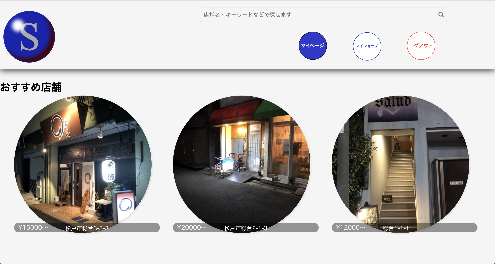
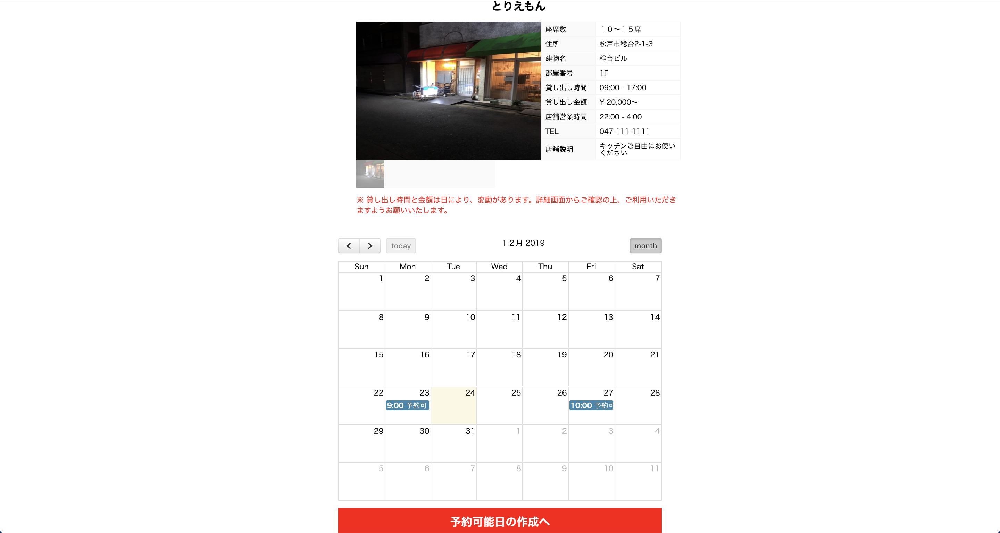
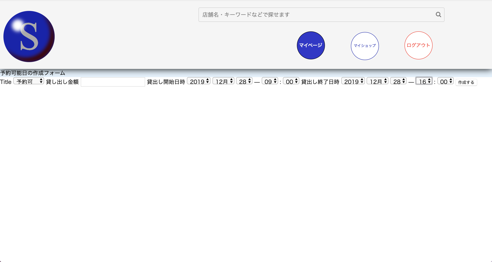
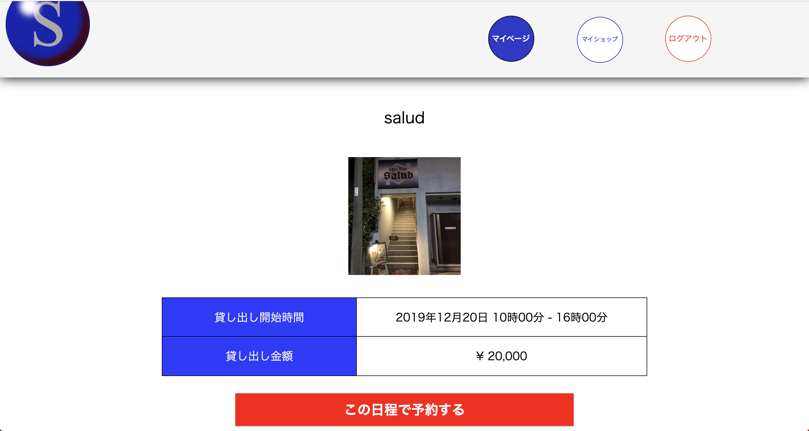

# README
## アプリの概要
私は個人経営の居酒屋さんが大好きで、よく飲みに行きます。  
常連として通っていたお店が、経営難で閉店していくのも多々見てきました。
大好きなお店がなくならない様に、経営者の方々が少しでも余裕を持って営業できる様にこのアプリでは、店舗の定休日や営業時間外の時間に貸しスペースとして開放し、副収入を得る機会を提供すると同時に、利用された方へのお店の宣伝となる様、作成した予約アプリです。

## 仕様説明
### トップページ

トップページでは写真から店舗詳細へ飛べる他、ヘッダーの検索バーからキーワード検索で店舗を探せます。またマイページリンクで自分のとった予約の確認、マイショップリンクから登録がない場合はマイショップ登録へ、登録がある場合はマイショップの詳細画面へとび、予約可能日の作成を行うことができます。

### 店舗詳細および予約カレンダー

店舗詳細画面では登録した写真、情報、予約カレンダーを表示しています。
店舗登録で最低価格の貸し出し金額と大まかな時間を登録しますが、イベントごとで金額、時間帯を登録できます。

マイショップの場合はカレンダー下のリンクから予約可能日の作成フォームへ移動できます。予約をとりたい場合はカレンダーの予約可能日の欄をクリックすることで確定画面へ飛びます。また、マイショップの予約可能日をクリックした際は、予約可能日の取り消しを行うことができます。

## 今後
コメント機能の追加や、店舗の宣伝となるようにメニューのページなどを追加したいと思っています。
fullcalendarの機能ももっと追加したいと思います。

# search-space DB設計
## usersテーブル
|Column|Type|Options|
|------|----|-------|
|name|string|null: false|
|email|string|null: false, unique: true|
|password|string|null: false|

### Association
- has_one :shop, dependent: :destroy
- has_many :events

## shopsテーブル
|Column|Type|Options|
|------|----|-------|
|name|string|null: false, index: true|
|price|integer|null: false, index: true|<!-- 貸し出し目安金額 -->
|explanation|text|null: false| <!-- 店舗設備等の説明 -->
|user_id|references|null: false, foreign_key: true|
|capacity|integer|null: false| <!-- 店舗の席数 -->
|address|text|null: false| <!-- 住所 -->
|house_number|string|null: false| <!-- 番地 -->
|building_name|string|<!-- 建物名 -->
|room_number|string| <!-- 部屋番号 -->
|lending_time_start|string|null: false| <!-- 貸し出し開始時間 -->
|lending_time_end|string|null: false| <!-- 貸し出し終了時間 -->
|business_hour_start|string|null: false| <!-- 営業開始時間 -->
|business_hour_end|string|null: false| <!-- 営業終了時間 -->
|phone_number|string|null: false| <!-- 電話番号 -->

### Association
- belongs_to :user
- has_many :images dependent: :destroy
- has_many :events

## imagesテーブル
|Column|Type|Options|
|------|----|-------|
|image|text|null: false|
|shop_id|references|null: false, foreign_key: true|
### Association
- belongs_to: shop

## eventsテーブル
|Column|Type|Options|
|------|----|-------|
|title|string|null: false|
|day_price|integer|null: false|<!-- イベントごとの値段 -->
|start_at|datetime|null: false|<!-- イベントごとの開始時間 -->
|end_at|datetime|null: false|<!-- イベントごとの終了時間 -->
|shop_id|references|foreign_key: true|
|borrower_id|references|foreign_key: {to_table: :users}|<!-- 借り手側id -->
|event_status|integer|null: false, default: 0|<!-- 予約の状態 -->
### Association
- belongs_to :user
- belongs_to :shop

